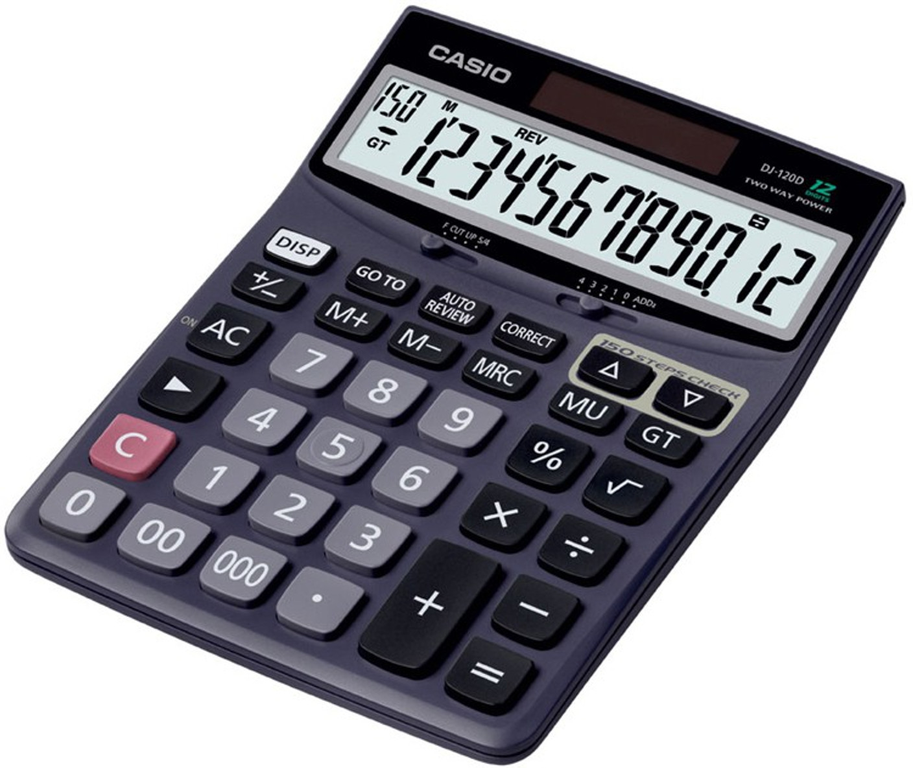

# Basic Calculator

## Table of Contents
- [Project Overview](#project-overview)
- [Components and Implementation](#components-and-implementation)
- [Board Interface](#board-interface)

## Project Overview

The **Basic Calculator** is a project created for use on the **Terasic DE-10 Standard board**. It utilizes an ALU circuit to perform common mathematical operations (addition, subtraction, multiplication, and division). The result is displayed in both binary and integer formats.

## Components and Implementation

- **ALU Circuit**
  - Implements logic for an adder, subtractor, multiplier, or divider.
  - The operation is selected using a two-bit operator.
  - Accepts two 10-bit inputs for the calculation.
  - Utilizes synchronous flip-flop like logic for results handling.
  - Uses behavioral modeling.
  - Represents a multiplexer.
 
- **Input Controller**
  - Implements logic to store operands A and B, and the operator code.
  - A state machine is utilized to advance between storing a specific input.
  - Can reset all the inputs.
  - Utilizes synchronous flip-flop like logic.
  - Uses behavioral modeling.

- **BCD-to-7-Segment Display Decoder**
  - Converts a BCD digit into signals for a 7-segment display.
  - Determines which segments to activate based on the input digit.
  - Displays signs for unique numbers like fractions and negative numbers.
  - Uses hybrid modeling (both behavioral and dataflow).
 
- **Top Calculator Entity**
  - Establishes ports that will be assigned pins for circuit functionality.
  - Creates 1 ALU, 1 input controller, and 6 BCD-to-7-Segment Display Decoders (for display of each digit or sign).
  - Holds logic necessary for the circuits to work together (converting inputs and ouputs).
  - Contains error handling for division by zero, overflow, and unexpected errors.
  - Uses structural modeling.

## Board Interface

- **Inputs**
  - **10 Switches:**  
    - All 10 switches for inputting any of the operands (A and B).
    - 2 switches (0-1) for selecting the two-bit operator.
  - **1 Clock:**  
    - Provides the clock signal for the synchronous ALU and input controller process.
  - **3 Key Buttons:**  
    - Key button 0: Used to load in the operand/operator code.
    - Key button 1: Used to reset the calculation (resets all operands, operator code, and results stored in registers).
    - Key button 2: Used to confirm the calculation for display.

- **Outputs**
  - **6 7-Segment Displays:**  
    - Display calculation results in the range of -999999 to 999999.
    - Displays special signs (negative, fraction).
  - **10 LED Lights:**  
    - Show the calculation results and error codes in binary form.
    - Handles values from 0 to 1023.
